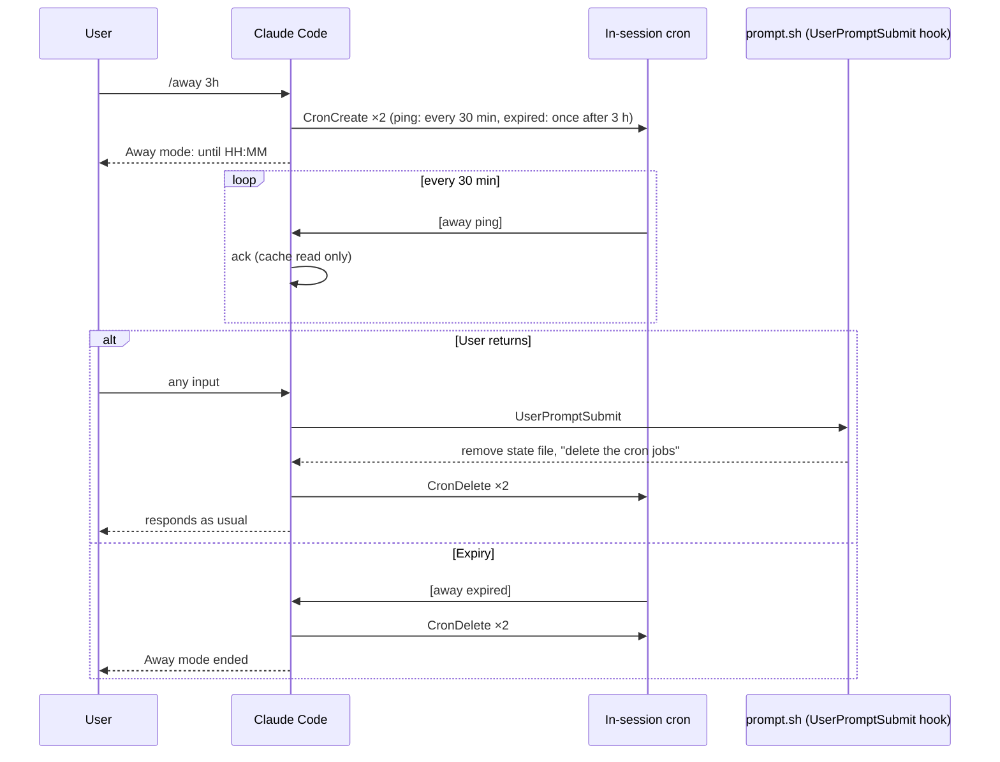

# away — Away mode for Claude Code
[日本語版 README](README.ja.md)

A skill that keeps pinging the session at a fixed interval while you're away, so the prompt cache doesn't expire.
This avoids the cost of rewriting the entire context into the cache when you come back.
Intended for subscription-authenticated use.

## How it works
Typing `/away` registers two jobs in the in-session cron.

- Ping job: sends the prompt `[away ping]` every 30 minutes. Claude replies with just `ack`
- Expiry job: sends `[away expired]` once after the given duration (default 3 hours). Claude deletes both the ping job and the expiry job itself, then ends

Each ping is only a cache read of the existing context plus a few output tokens.
That is far cheaper than rewriting the cache after it has expired.



## Requirements
- Prompt cache TTL must be 1 hour. With a 5-minute TTL, every 30-minute ping rewrites the cache and increases cost instead. (Subscription-authenticated sessions default to a 1-hour TTL)
- Once you exceed your usage limit and enter extra usage, the TTL drops to 5 minutes by default. Do not use this skill in that state
- In-session cron (`CronCreate`) must be available. It does not work where `CLAUDE_CODE_DISABLE_CRON` is set
- On Windows, Git Bash is required. Without it the hook runs under PowerShell and fails
- Claude Code must support skills-directory plugins (recognizes `~/.claude/skills/<name>/.claude-plugin/plugin.json`)

## Installation
The location is fixed at `~/.claude/skills/away/`.

```bash
git clone https://github.com/TominagaTeam/away ~/.claude/skills/away
```

Restart Claude Code and `/away` becomes available.

## Usage

```
/away [duration]
/away off
```

| Argument | Meaning | Default | Examples |
|---|---|---|---|
| duration | How long to stay in away mode | 3h | `90m` `2h30m` `45m` |

Examples:

```
/away            # (no argument) 3 hours
/away 90m        # 90 minutes
/away off        # disarm
```

On start it prints something like "Away mode: until HH:MM (3h). Pinging every 30m (about 6 times)".

The ping interval is fixed at 30 minutes. It is the longest period expressible as a cron minute list and leaves enough margin against the 1-hour cache TTL (cron may fire up to 10% late). A shorter interval would not extend the cache any further and would only add cost, so it is not an argument.

### Disarming
- **When you're back, just type a prompt**. The hook detects it, deletes the cron jobs, and Claude responds as usual
- `/away off` (`stop` / `cancel` also work) disarms explicitly
- It ends automatically when the duration expires

## Limits
| Item | Value |
|---|---|
| Ping interval | fixed at 30 minutes |
| Maximum duration | 12 hours |
| Cron job lifetime | until the session closes. Claude Code caps it at 7 days |

## Notes
- **The session stays in its normal idle state while waiting**. Nothing holds the process (no Stop hook), so it does not trigger the Claude Desktop unresponsive-session watchdog (about 1000 seconds). It runs at the same interval in both the desktop app and the terminal CLI
- **The hook is registered only in the session where `/away` was typed**. Other sessions are unaffected
- **Claude performs the cron deletion on disarm**. The hook only removes the state file and tells Claude to delete the jobs, so if Claude skips that instruction the jobs remain. In that case the hook re-issues the instruction on the next `[away ping]`. To delete manually, say "delete the away cron jobs"
- The state file is `state/away.<session_id>.state` and the log is `away.log`, both inside the skill directory. State files not updated for 12 hours or more are removed on the next `/away`
- `allowed-tools` is limited to launching `arm.sh` and the cron tools (`CronCreate` / `CronDelete` / `CronList`)

## Troubleshooting

| Symptom | What to check |
|---|---|
| `/away` does not appear in the `/` menu | Is it at `~/.claude/skills/away/`? Did you restart Claude Code? |
| `Shell command permission check failed` | Do `allowed-tools` in `SKILL.md` and the `!` line command match? (They do unless edited) |
| No pings arrive | Does the `armed` line in `away.log` include `ping_cron=`? Did Claude call `CronCreate` (look for "Scheduled recurring job" in the response)? |
| Pings continue after you're back | Say "delete the away cron jobs". If the hook isn't running, check that Git Bash is installed |
| It doesn't end at expiry | Check with `CronList` that the `[away expired]` job is registered |

## Disclaimer
- The effect depends on how Claude Code's prompt cache works. Cost savings are not guaranteed
- Each ping is an API call and consumes a small amount of your usage limit. Use it only when you actually intend to come back
- Changes to Claude Code's hook or cron behavior may break this skill
- Use at your own risk

## License
MIT
