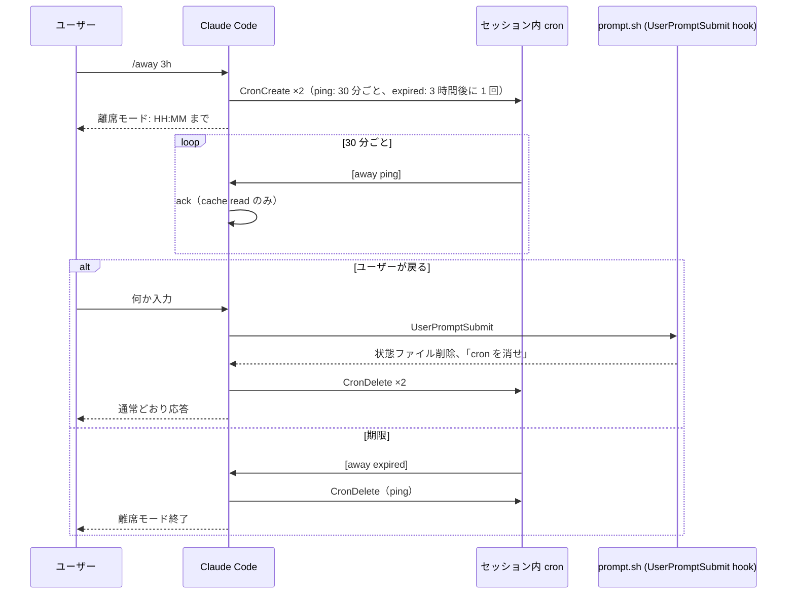

# away — Claude Code 離席モード
離席するとき、プロンプトキャッシュが切れないよう一定間隔で ping を打ち続けるスキル。
戻ってきたときに全コンテキストをキャッシュへ書き直すコストを避ける。
サブスク認証版での利用を想定。

## 動作内容
`/away` を打つと、セッション内 cron に 2 つのジョブを登録する。

- ping ジョブ: 30 分ごとに `[away ping]` というプロンプトを流す。Claude は `ack` とだけ答える
- 期限ジョブ: 指定時間（既定 3 時間）後に 1 回だけ `[away expired]` を流す。Claude は ping ジョブを消して終了する

1 回の ping は、キャッシュ済みコンテキストの読み取りと数トークンの出力だけ。
キャッシュが切れて戻ったときの再書き込みと比べて十分に安い。



## 前提条件
- プロンプトキャッシュの TTL が 1 時間であること。TTL が 5 分の環境では 30 分ごとの ping は毎回キャッシュの書き直しになり、逆にコストが増える。（サブスク認証版の会話ではデフォルトの TTL が 1 時間）
- 利用枠を超えて超過利用（extra usage）に入ると TTL はデフォルトで 5 分に落ちる。その状態では使わないこと
- セッション内 cron（`CronCreate`）が使えること。`CLAUDE_CODE_DISABLE_CRON` が設定された環境では動かない
- Windows は Git Bash が必要。無い場合 hook が PowerShell で実行され、動かない
- Claude Code は skills-directory plugin に対応したバージョン（`~/.claude/skills/<name>/.claude-plugin/plugin.json` を認識するもの）

## インストール
置き場所は `~/.claude/skills/away/` 固定。

```bash
git clone https://github.com/TominagaTeam/away ~/.claude/skills/away
```

Claude Code を再起動すると `/away` が使えるようになる。

## 使い方

```
/away [duration]
/away off
```

| 引数 | 意味 | 既定 | 例 |
|---|---|---|---|
| duration | 離席モードを続ける時間 | 3h | `90m` `2h30m` `45m` |

例:

```
/away            # (引数無し) 3 時間
/away 90m        # 90 分
/away off        # 解除
```

開始すると「離席モード: HH:MM まで（3h）。30m ごとに ping（約 6 回）」のように表示される。

ping の間隔は 30 分固定。cron の分リストで表せる最長の周期で、キャッシュ TTL 1 時間に対して十分な余裕がある（cron の発火は最大 10% 遅れる）。短くしても延命効果は変わらずコストが増えるだけなので、引数にはしていない。

### 解除
- **離席から戻ったらそのままプロンプトを打つ**。hook が検知して cron を消し、通常どおり応答する
- `/away off`（`stop` / `cancel` も同じ）で明示的に解除
- 期限が来れば自動で終了する

## 制限値
| 項目 | 値 |
|---|---|
| ping の間隔 | 30 分固定 |
| duration の上限 | 12 時間 |
| cron ジョブの寿命 | セッションを閉じるまで。Claude Code 側の仕様で最長 7 日 |

## 動作上の注意
- **待機中もセッションは通常の idle 状態**。Stop hook などでプロセスを占有しないので、Claude Desktop アプリの無応答監視（約 1000 秒）に掛からない。デスクトップ・ターミナル CLI のどちらでも同じ間隔で動く
- **hook は `/away` を打ったセッションでだけ登録される**。使っていないセッションには何も影響しない
- **解除時の cron 削除は Claude が行う**。hook は状態ファイルを消して「消せ」と指示するだけなので、Claude がその指示を飛ばすとジョブが残る。その場合、次の `[away ping]` が来たときに hook が再度削除を指示する。手動で消すなら「away の cron を消して」と言えばよい
- 状態ファイルは `state/away.<session_id>.state`、ログは `away.log`（どちらもスキルのディレクトリ内）。12 時間以上更新されていない状態ファイルは次回の `/away` で自動削除される
- `allowed-tools` は `arm.sh` の起動と cron ツール（`CronCreate` / `CronDelete` / `CronList`）に限定

## トラブルシューティング

| 症状 | 確認すること |
|---|---|
| `/away` が `/` メニューに出ない | 置き場所が `~/.claude/skills/away/` か。Claude Code を再起動したか |
| `Shell command permission check failed` | `SKILL.md` の `allowed-tools` と `!` 行のコマンドが一致しているか（編集していなければ一致する） |
| ping が来ない | `away.log` の `armed` 行に `ping_cron=` が出ているか。Claude が `CronCreate` を呼んだか（応答に「Scheduled recurring job」があるか） |
| 戻ったのに ping が続く | 「away の cron を消して」と言う。hook が動いていなければ Git Bash が入っているか確認 |
| 期限が来ても終わらない | `[away expired]` のジョブが登録されているか `CronList` で確認 |

## 免責
- 効果は Claude Code のプロンプトキャッシュの仕組みに依存。常にコスト削減になることは保証しない
- ping は API 呼び出しであり、少量ながら利用枠を消費する。本当に戻ってくる離席のときだけ使うこと
- Claude Code の hook や cron の仕様が変わると動かなくなる可能性がある
- 何か不具合が起きても利用は自己責任で

## ライセンス
MIT
